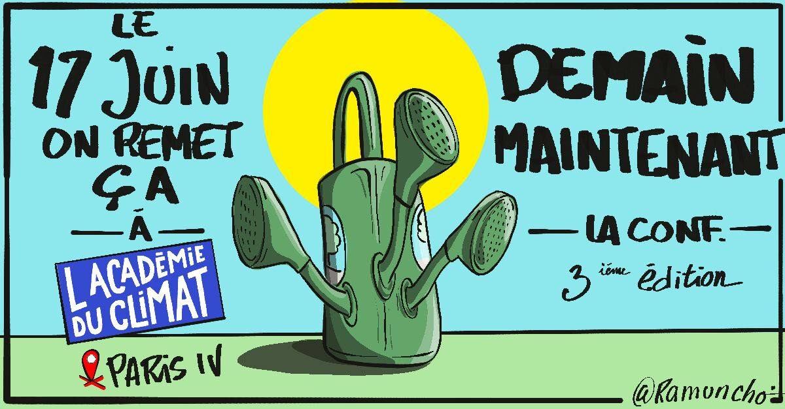
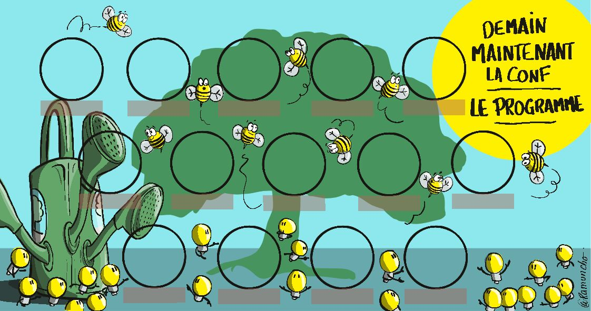

# demainMaintenantLaConf

Des visuels pour la conférence "Demain Maintenant" édtion 3 17 Juin 2025 à l'académie du Climat 
Des images sous licence CC BY-NC 4.0.

---

### Licence et Utilisation

Les dessins et supports visuels contenus dans ce dépôt sont mis à disposition sous la licence **Creative Commons Attribution-NonCommercial 4.0 International (CC BY-NC 4.0)**. Voici un résumé des conditions d'utilisation :

- **Attribution** : Vous êtes libre de partager et d'adapter les dessins, à condition de créditer l'auteur original. Veuillez inclure une mention claire de mon nom et un lien vers ce dépôt.

- **NonCommercial** : Vous pouvez utiliser ces dessins uniquement à des fins non commerciales. Cela signifie que vous ne pouvez pas les utiliser dans un contexte où l'objectif principal est de générer des revenus ou un avantage commercial.

Pour plus de détails, veuillez consulter le fichier [LICENSE](https://github.com/JeanPierreBONNAFOUS/demainMaintenantLaConf/blob/main/License) ou visiter le site de Creative Commons : [CC BY-NC 4.0](https://creativecommons.org/licenses/by-nc/4.0/).

---

### Exemple d'attribution :

Si vous utilisez l'un de ces dessins, merci de me créditer de la manière suivante :

```
Dessin réalisé par Jean-Pierre BONNAFOUS / ramuncho - [Sur Github](https://github.com/JeanPierreBONNAFOUS/demainMaintenantLaConf)
```






MAJ 13/05
